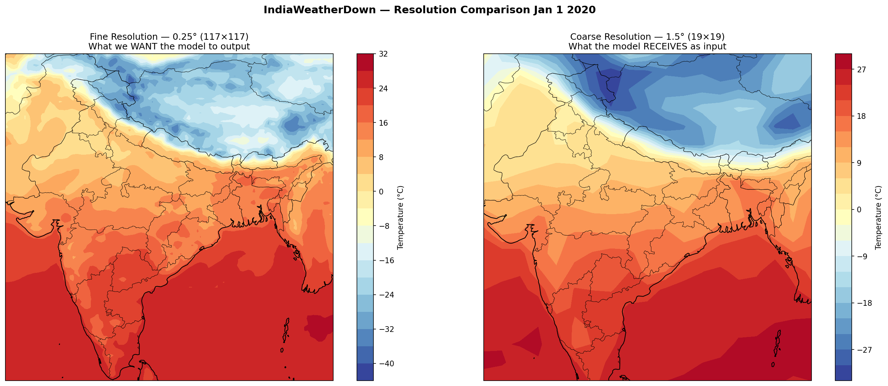
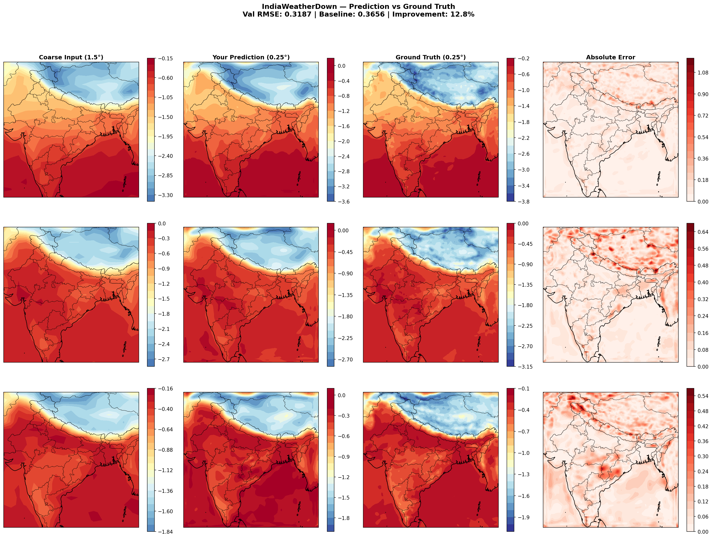
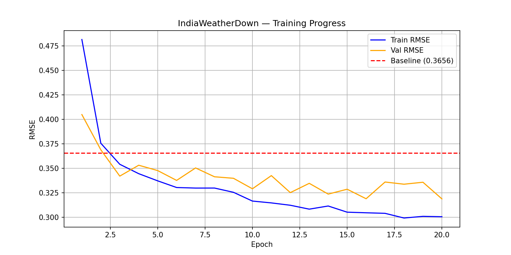

# IndiaWeatherDown 
> A lightweight CNN-Transformer model for high-resolution weather downscaling over India (1.5° → 0.25°)

## Motivation
[ArchesWeather](https://arxiv.org/abs/2412.12971) (Couairon et al., 2024) produces accurate global weather forecasts at 1.5° resolution — too coarse for regional applications like cyclone tracking or monsoon prediction over India. At 1.5°, each grid square covers ~165km, meaning cities like Jaisalmer and Jodhpur fall within the same pixel, losing critical local detail.

This project builds a lightweight downscaling model that sharpens coarse 1.5° predictions to 0.25° (~28km) specifically for the Indian subcontinent — directly addressing the resolution limitation noted in the ArchesWeather paper.

---

## Resolution Comparison
*Left: Fine 0.25° (ground truth) | Right: Coarse 1.5° (model input)*



---

## Method

A three-stage CNN-Transformer architecture:
```
Input (1.5° coarse)          Output (0.25° fine)
(batch, 5, 19, 19)    →      (batch, 5, 117, 117)

Stage 1 — Encoder (CNN)
Extracts local weather patterns
(Himalayan gradients, Western Ghats boundaries)

Stage 2 — Bottleneck (Transformer)  
Captures global teleconnections across India
(monsoon onset, pressure systems)

Stage 3 — Decoder (Progressive Upsampling CNN)
19×19 → 38×38 → 76×76 → 114×114 → 117×117
```

**Variables:** T2m, U10, V10, MSL, TP (5 channels)  
**Parameters:** 863,301 (lightweight, Colab-trainable)  
**Framework:** PyTorch

---

## Results

| Model | Val RMSE | Improvement |
|-------|----------|-------------|
| Bilinear baseline | 0.3656 | — |
| **IndiaWeatherDown** | **0.3187** | **+12.8%** |


*Columns: Coarse Input → Model Prediction → Ground Truth → Absolute Error*  
*Rows: January (Winter) | June (Monsoon) | October (Post-Monsoon)*

---

## Training Curve



Model consistently beats bilinear baseline from epoch 3 onwards across all seasons.

---

## Dataset

- **Source:** ERA5 Reanalysis (ECMWF) via CDS API
- **Region:** India bounding box (8°N–37°N, 68°E–97°E)
- **Period:** 2020 (1,464 timesteps at 6-hourly resolution)
- **Split:** 70% train / 15% val / 15% test

---

## Limitations & Future Work

- Currently trained on 1 year of data — extending to 2018–2021
- Model exhibits mild smoothing (underestimates temperature extremes), 
  motivating future work on perceptual loss functions
- Terrain features (elevation, land-sea mask) not yet incorporated — 
  expected to improve predictions near Western Ghats and Himalayas
- Resolution still limited by coarse ArchesWeather input at 1.5°

---

## References

Couairon et al. (2024). *ArchesWeather & ArchesWeatherGen: efficient 
ML models for weather forecasting and generation.* arXiv:2412.12971

---

## Author

**Bhavini Kasana** — Master's student in AI, ESIEE Paris  
[LinkedIn](https://linkedin.com/in/bhavini-kasana-0b65151a9) | 
[GitHub](https://github.com/bhavinikasana12)
